# Amazon IVS For Education 

Reproduce video streaming technology, in real-time applied to education, constitutes a powerful tool that allows showing and explaining any subject within the teaching-learning process in education, from traditional K-12 to higher educational institutions takes an important role, distance learning services such as online education where live and on-demand videos provide a connection to educators and other students.

Deploy streaming video today to enable :

* Live streaming events for students, teachers, and parents
* Broadcasting live events meetings for large groups
* Live events with quizzes

Amazon Interactive Video Service ([Amazon IVS](https://aws.amazon.com/ivs/)) is a managed live streaming solution that is quick and easy to set up, and ideal for creating interactive video experiences. Send your live streams to [Amazon IVS](https://aws.amazon.com/ivs/) using streaming software and the service does everything you need to make a low-latency live video available to any viewer around the world, letting you focus on building interactive experiences alongside the live video. You can easily customize and enhance the audience experience through the[Amazon IVS](https://aws.amazon.com/ivs/) player SDK and timed metadata APIs, allowing you to build a more valuable relationship with your viewers on your own websites and applications.

The service enables you to create a channel using either the Amazon Interactive Video Service  ([Amazon IVS](https://aws.amazon.com/ivs/)) Console or the CLI. You can then use any standard streaming software to stream video to this channel, and the service does everything required to make the live video available to any viewer around the world. The service includes a player SDK that makes it straightforward to get the live video integrated into your web, iOS, or Android project.

This is a sample solution to quickly enable an audience for webinars, master classes, or events to deliver an interactive experience for streaming video delivered via Amazon Interactive Video Service ([Amazon IVS](https://aws.amazon.com/ivs/)) and Streaming from mobile phones. This sample solution consists of integration with the IVS player SDK, and mobile phone as a source of streaming video and static hosted web page to display video for viewers.

## Solution Overview

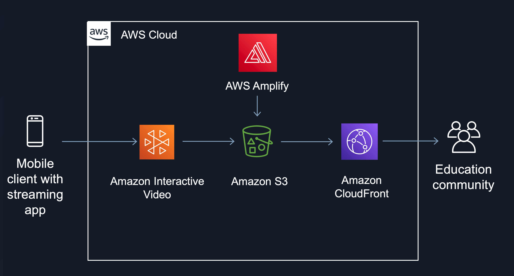

## Getting Started

An [Amazon IVS](https://aws.amazon.com/ivs/) channel stores configuration information related to your live stream. You first create a channel and then contribute a video to it using the channel’s stream key to start your live stream.

As part of channel creation, the following items are assigned:

* An *ingest server* identifies a specific Amazon IVS component that receives the stream, along with an ingestion protocol (RTMPS).
* Amazon IVS assigns a *stream key* when you create a channel and uses it to authorize streaming. ***Treat the stream key like a secret, since it allows anyone to stream to the channel***.
* A *playback URL* identifies the endpoint to start playback for a specific channel. This endpoint can be used globally. It automatically selects the best location from the Amazon IVS global content delivery network for a viewer to stream the video. (Note that Amazon IVS does not support custom domains for playback. *Do not proxy the playback URL with your own domain; that does not work and will cause issues.*)

## Walk-through

### Step 1. Create the Amazon IVS channel

Use one of these guides to create a new Amazon IVS Channel:

To create a channel using console:

Open the [Amazon IVS console.](https://console.aws.amazon.com/ivs/homepage)

In the **Get started** box (top right), choose **Create Channel**.
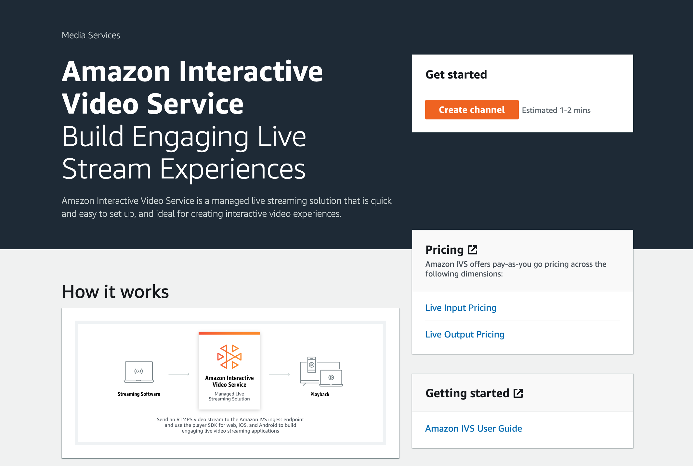
In the box Setup specify a **Channel name**. Channel names are not unique, but they provide a way for you to distinguish channels other than the channel ARN (Amazon Resource Name).

For this Walk-through under **Channel configuration**, accept the **Default configuration**. 

Click **Create channel** to create a new channel with a unique ARN. A channel details page is displayed for the new channel; keep this open.

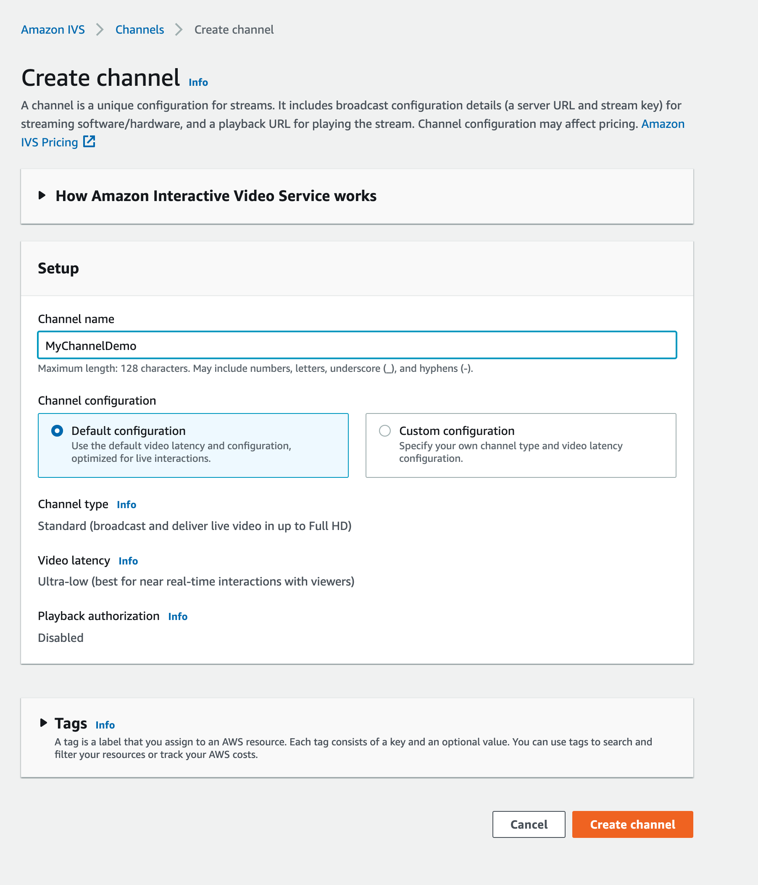
**Important**:
In the **Stream configuration** area, please note the **Ingest server** and **Stream key** values. You will use these values in the next step to set up streaming.

In the **Playback configuration** area, note the **Playback URL** value. **Continue** You will use it later to play back your stream.

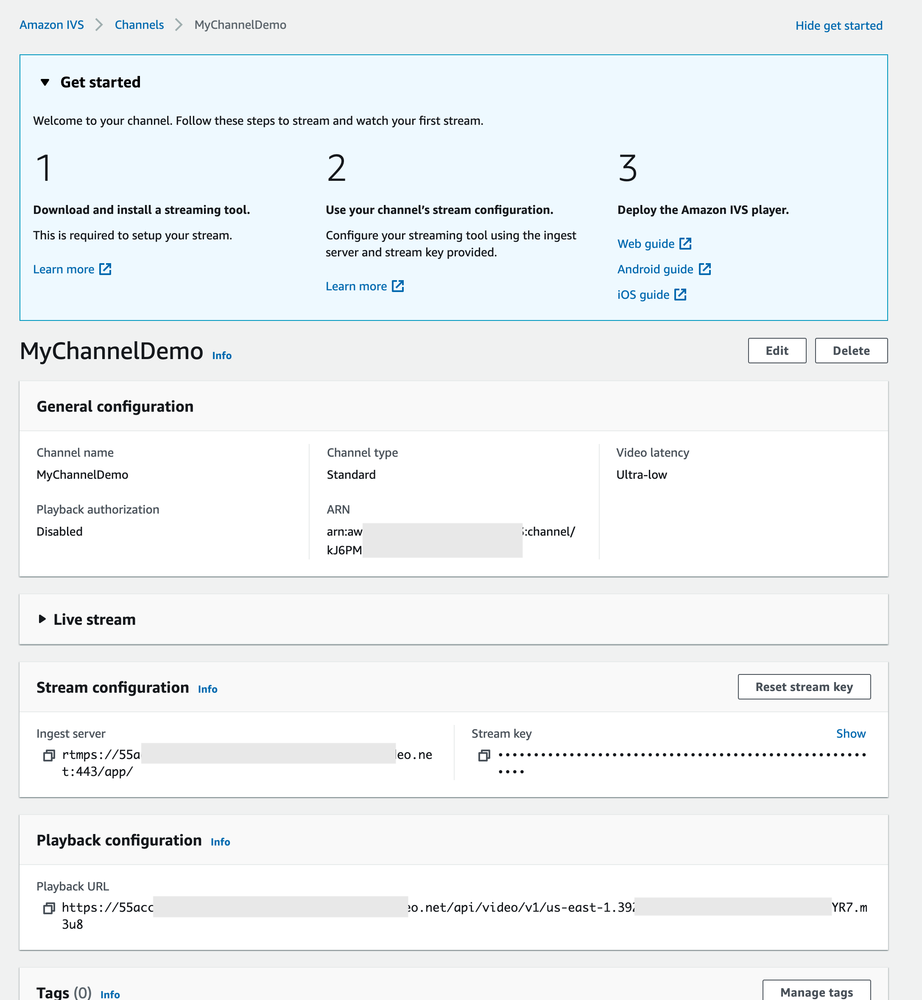

### Step 2. Setup Amazon IVS web player

The Amazon Interactive Video Service (IVS) Player SDK for Web can be integrated with [player frameworks](https://docs.aws.amazon.com/ivs/latest/userguide/SWPG.html#swpg-framework-integrations) like Video.js or  used as standalone on top of an HTML `<video>` element.

To continue, copy the following source code and create a new file on your PC, name this file [index.html](https://raw.githubusercontent.com/aws-samples/ivs-timedmetadata-polling-demo/master/Tutorial_1/player.html)

```html

<!doctype html>
<html lang="en">
    <!-- # Copyright Amazon.com, Inc. or its affiliates. All Rights Reserved. -->
    <!-- # SPDX-License-Identifier: MIT-0 -->
    <head>
        <meta http-equiv="Content-Type" content="text/html; charset=utf-8"/>
        <link href="https://cdnjs.cloudflare.com/ajax/libs/video.js/7.6.6/video-js.css" rel="stylesheet">
        <script src="https://cdnjs.cloudflare.com/ajax/libs/video.js/7.6.6/video.min.js"></script>
        <script src="https://player.live-video.net/1.2.0/amazon-ivs-videojs-tech.min.js"></script>
    </head>
    
    <body>
        <h1>Video streaming from my mobile phone</h1>
        <div class="video-container">
            <video id="amazon-ivs-videojs" class="video-js vjs-4-3 vjs-big-play-centered" controls autoplay playsinline></video>
        </div>
        <style>
            body {
                margin: 0;
            }
            h1 { color: #111; 
                font-family: 'Helvetica Neue', sans-serif; 
                font-size: 45px; 
                font-weight: bold; 
                letter-spacing: -1px; 
                line-height: 1; 
                text-align: center; 
            }
            .video-container {
                width: 640px;
                height: 480px;
                margin: 15px;
                margin: auto;
            }
        </style>
        <script>
            (function play() {
                // Get playback URL from Amazon IVS API
                var PLAYBACK_URL = 'CHANGEME!!';
                
                // Register Amazon IVS as playback technology for Video.js
                registerIVSTech(videojs);
    
                // Initialize player
                var player = videojs('amazon-ivs-videojs', {
                   techOrder: ["AmazonIVS"]
                }, () => {
                   console.log('Player is ready to use!');
                   // Play stream
                   player.src(PLAYBACK_URL);
                });
            })();
        </script>
    </body>
</html>

```


Using your preferred text editor, open the file **index.html.** To continue, you will need to change a variable value to point to the **video.js** player to your newly created stream. Please look for the variable PLAYBACK_URL:

```
const PLAYBACK_URL = "CHANGEME!!"
```

Replace the **`CHANGEME!!`** value with the **Playback URL** from the **Playback Configuration** section of the **Amazon IVS console**. The URL should end with an .**m3u8** file extension.

Next, you will need to host this webpage created above using [AWS Amplify](https://aws.amazon.com/amplify/console/). For this, let’s compress our html file as **index.html.zip** to continue

### Step 3. Deploy static html page with AWS Amplify,

With [AWS Amplify](https://aws.amazon.com/amplify/console/)  you can deploy static websites to deliver HTML, JavaScript, images, video and other files to your website visitors. Static websites are very low cost, it provides high-level of reliability, require almost no IT administration, and can scale to handle enterprise-level traffic with no additional work.

Using [AWS Amplify](https://aws.amazon.com/amplify/console/) in the AWS console. AWS Amplify provides fully managed hosting for static websites and web apps. Amplify’s hosting solution leverages [Amazon CloudFront](https://aws.amazon.com/cloudfront/) and [Amazon S3](https://aws.amazon.com/s3/) to deliver your site assets via the AWS content delivery network (CDN).

Open [AWS Amplify console](https://us-east-1.console.aws.amazon.com/amplify/home) and click in GET STARTED button
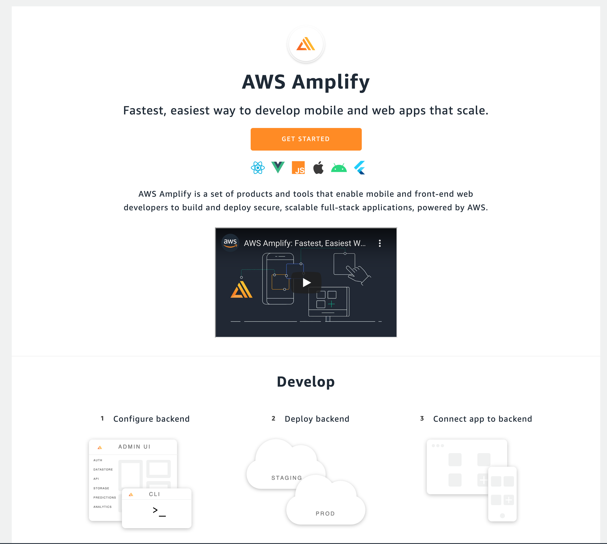

Choose and click **Get Started,** located on the right side corner, right under the box labeled **Deliver**

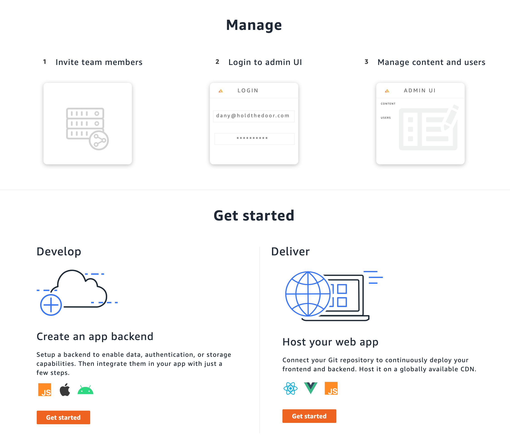

Choose **Deploy without Git Provider** and click on **Continue**

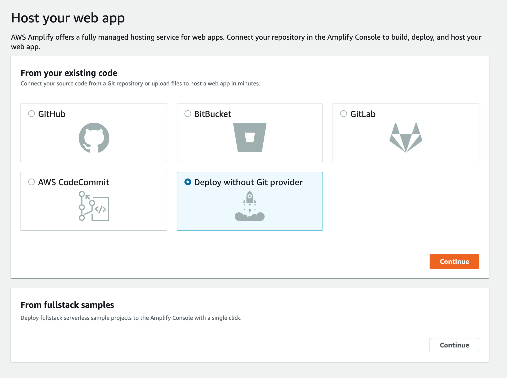

On Section **Manual deploy**, set the **App Name** with a descriptive, meaninful name that you wish, for this example set the value to **ivsdemo**, after this, click on **Choose files** to upload the previously compressed file called **index.html.zip**, After the file is uploaded, you should see a page like the image below, when the upload is ready, click on **Save and deploy** button to deploy the website.

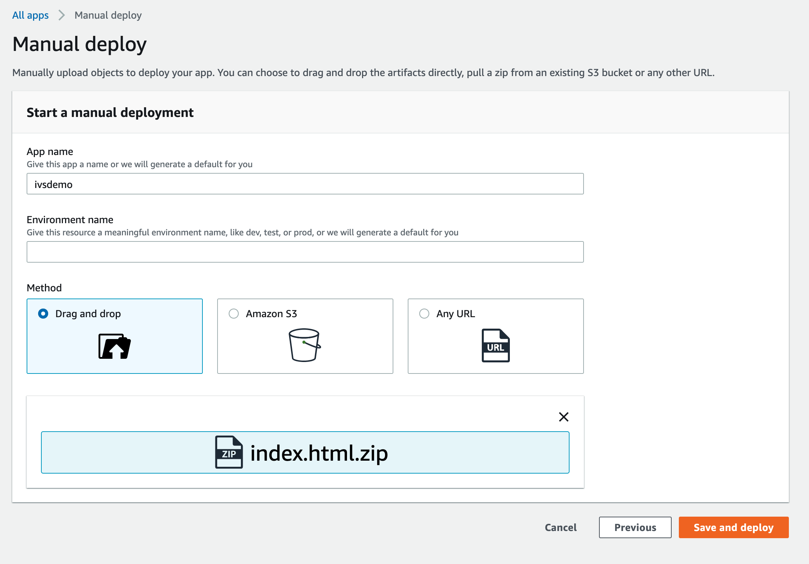You should see a page like the image below when deploy has finished.


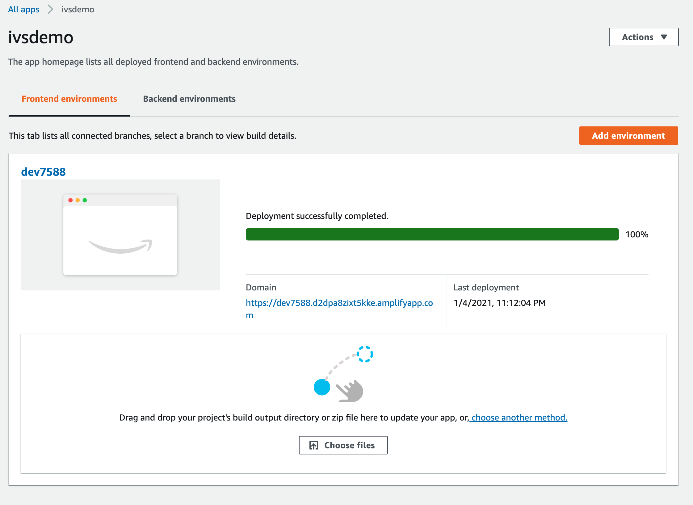
To enter the website, please do click on the link located under the **Domain** Label. You should be able to see a webpage like above image
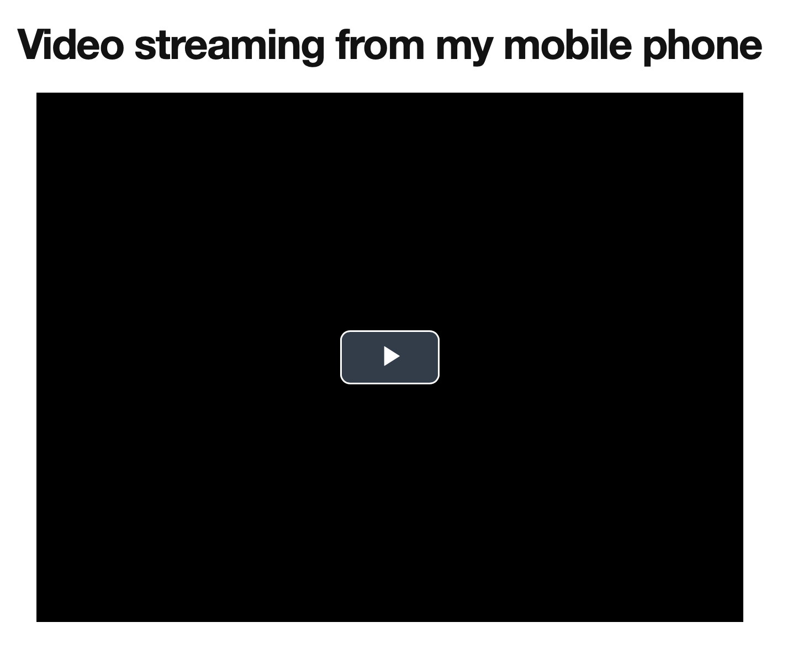
Now,  it’s time to setup our streaming service to be able to stream live-video from a mobile phone.


### Step 5. Setting up live streaming on your mobile phone from Android and iOS with Larix Broadcaster

1. To enable streaming from you mobile phone, follow the user guide **Stream from Android and iOS with Larix Broadcaster**. This will be located on the **Amazon Interactive Video Service** User Guide, Under the [Encoder Configuration](https://docs.aws.amazon.com/ivs/latest/userguide/encoder-config.html#encoder-config-stream-larix) section. 

*Important Notes:*
A. You will need to access your mobile phone App Store to download Larix Broadcaster App.
B. You will use the Ingest Server and Stream Key that were provided for you on step 1.

* **Always verify that your stream works.**

Navigate to the video stream on the [**Amazon IVS** console](https://console.aws.amazon.com/ivs) to watch what is being streamed and manage the live stream. You should see a web page like the image below.

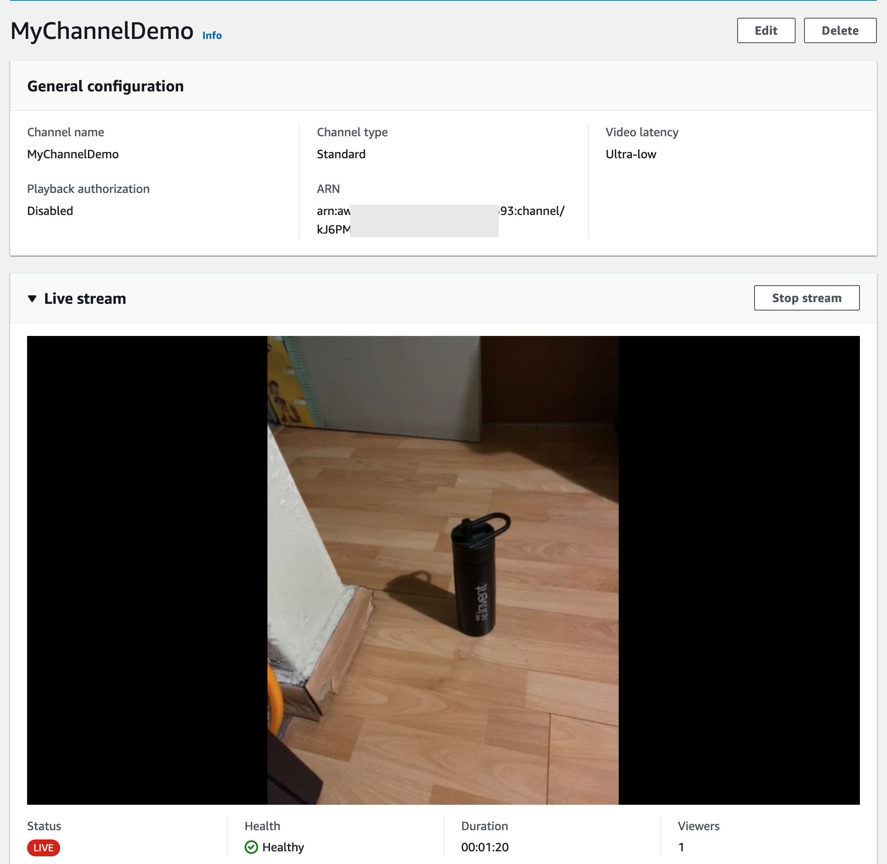

* **Testing the Stream from Static Html Web Page created before**

Now, open your favorite web browser (we recommend Firefox or Chrome) and use the URL that was generated by AWS Amplify on step 3. This, where you placed the index.html document.

After you click on the **play** button, you should get a web page like in the image below.
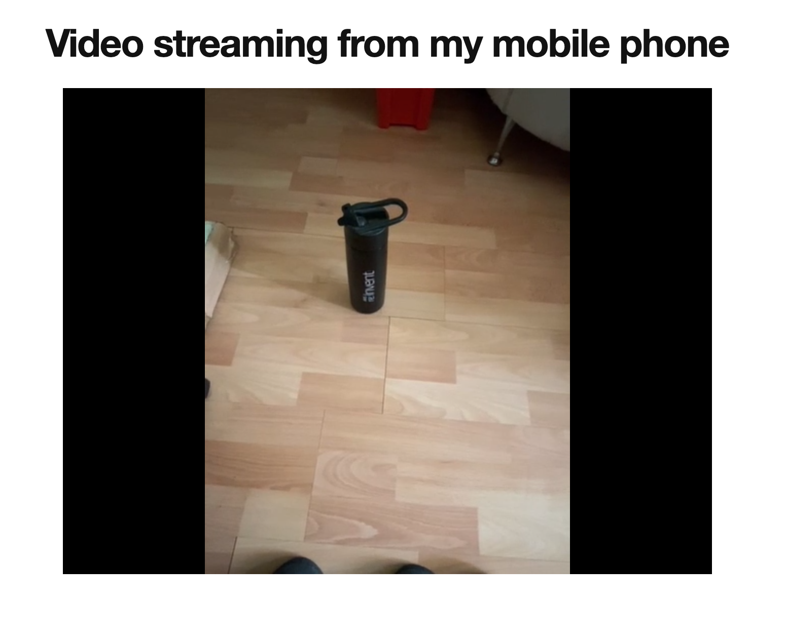

Congratulations! You set up your first Streaming Video Interactive. 

## Known issues and limitations

* These code samples were written for demonstration purposes and not for production use.
* These code samples were only tested on Chrome version 87.0 and Firefox version 84.0.

## About Amazon IVS

Amazon Interactive Video Service (Amazon IVS) is a managed live streaming solution that is quick and easy to set up, and ideal for creating interactive video experiences.
Amazon IVS can deliver video with latency under five seconds. For a traditional Over-The-Top (OTT) stream, latency may be as high as 30 seconds.

[Learn more](https://aws.amazon.com/ivs/):

* [Amazon IVS docs](https://docs.aws.amazon.com/ivs/)
* [User Guide](https://docs.aws.amazon.com/ivs/latest/userguide/)
* [API Reference](https://docs.aws.amazon.com/ivs/latest/APIReference/)
* [Setting Up for Streaming with Amazon Interactive Video Service](https://aws.amazon.com/blogs/media/setting-up-for-streaming-with-amazon-ivs/)
## Security

See [CONTRIBUTING](CONTRIBUTING.md#security-issue-notifications) for more information.

## License

This library is licensed under the MIT-0 License. See the LICENSE file.

